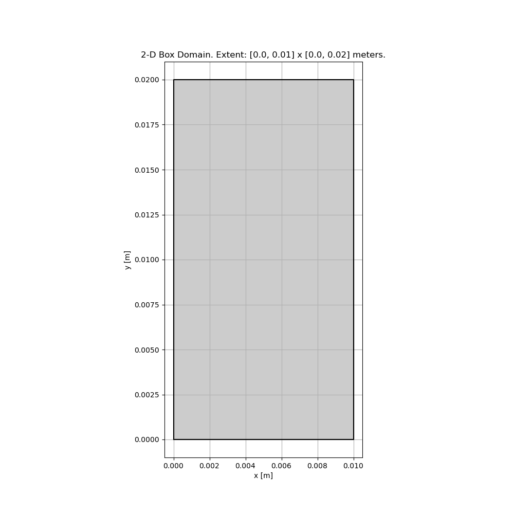
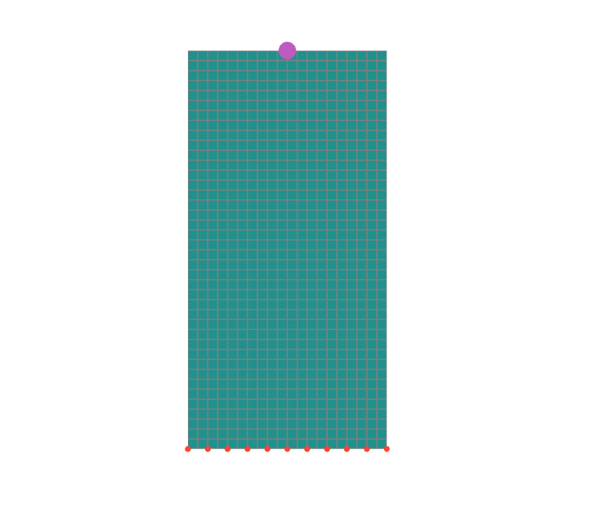
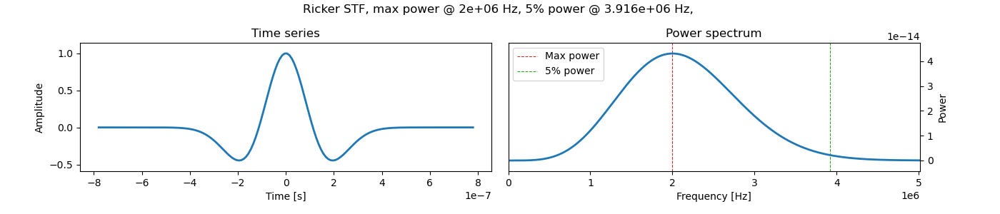
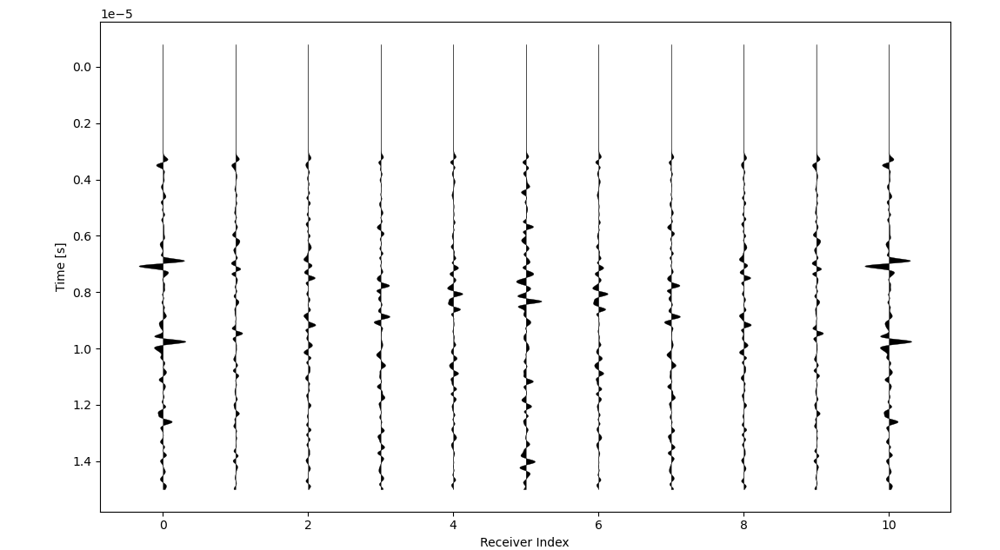
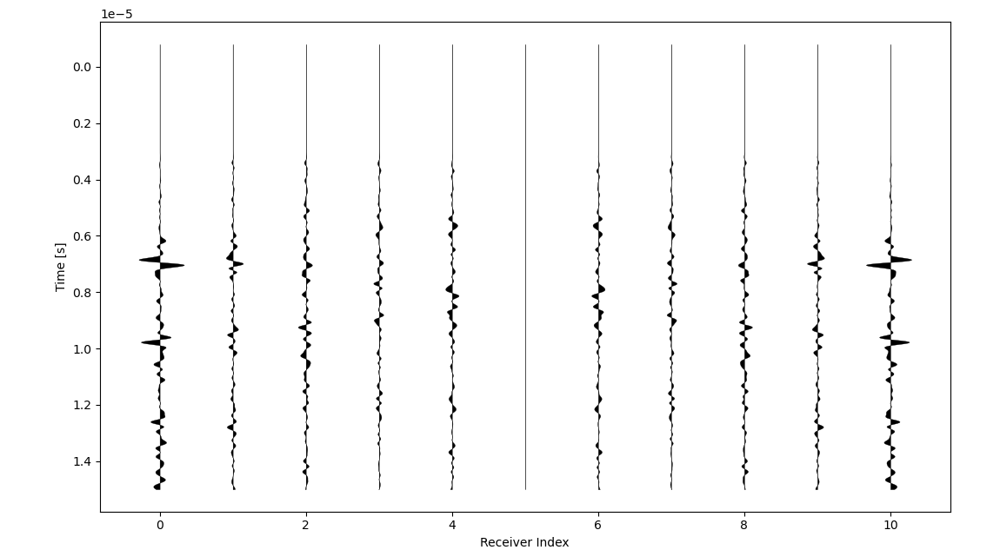
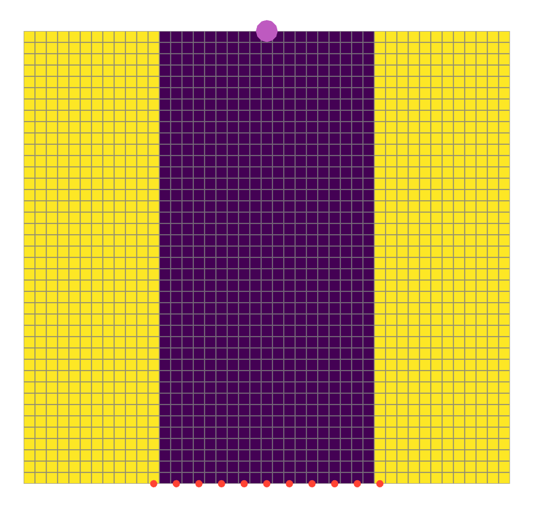
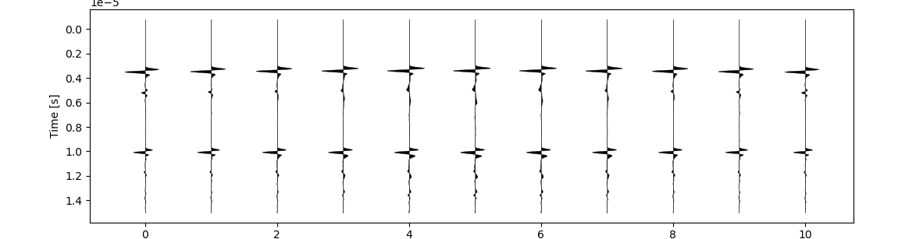
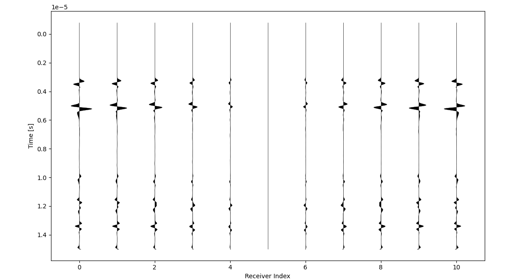

# Full wavefield simulation of Linear Elastic model

## Isotropic elastic model

[isotropic.py](https://github.com/oliverwfy/Salvus/blob/main/elastic_model/isotropic/isotropic.py) simulates wave propagation in the isotropic elastic model.

The **domain** is defined as a 2D Box with 10mm x 20mm.

Then generate mesh and config event (the spatial information of sources and receives), sources in Salvus initialize the force $\mathbf{f}$ in the strong form of elastodynamics equation.

> ## Elastodynamics Equation:
> $$ \rho\mathbf{\ddot{u}} = \nabla \cdot \mathbf{C} (\nabla \mathbf{u}) + \mathbf{f} $$
> 

The default mesh alone with a **vector point source** at (5mm, 20mm) and **11 receivers** at the bottom line (**y=0**) is shown below:

The [**spectral-element method**](https://en.wikipedia.org/wiki/Spectral_element_method) works by approximating the dynamic field variables as [**Lagrange polynomials**](https://en.wikipedia.org/wiki/Lagrange_polynomial) with time-varying coefficients. These polynomials are defined using the [**Gauss-Lobatto-Legendre (GLL)**](https://en.wikipedia.org/wiki/Gaussian_quadrature) collocation points defined within each element. Salvus use polynomials of order of degree 4 as default, thus there will be 5 GLL points along each edge of a given element, which results in 25 and 125 points each for 2-D and 3-D elements, respectively.

The **source time function (stf)** used is the Richer wavelet with center frequency at 2MHz and only in the direction of **-y**,

The received **displacement fields** in **y** direction:  

The received **displacement fields** in **x** direction:  

Here is an animation of the full wavefield simulation (**magnitude of displacement field**):

## absorbing boundary 

The mesh with [**absorbing boundary**](https://pubs.geoscienceworld.org/ssa/bssa/article-abstract/67/6/1529/117727/Absorbing-boundary-conditions-for-acoustic-and) which is highlighted in yellow as shown below:

The received **displacement fields** in **y** direction:  

The received **displacement fields** in **x** direction:  

Here is an animation of the full wavefield simulation (**magnitude of displacement field**):

